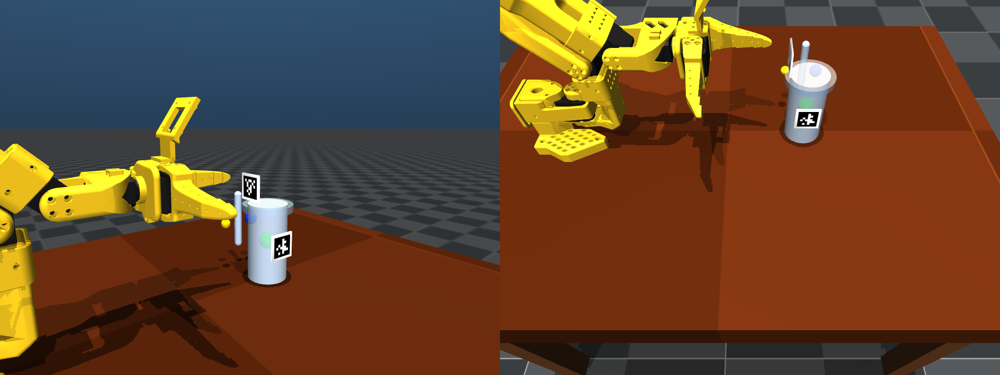

# Offset calculations (tag-relative grasps)

This note explains how **offsets and orientations** are defined for the simulation when AprilTags sit on one part of an object but the gripper must target another (for example, a handle while tags stay on the cup wall).

The implementation lives in `grasp_library.py`; the cup pickup scenario wires it through `mujoco_sim/run_cup_pickup.py` and `motion.solve_ik`.

---

## The three layers of “offset”

### 1. Tag anchors (object frame → tag measurements)

Each AprilTag on an object is a **`TagAnchor`**: it stores where that tag’s coordinate frame sits **inside the object’s body frame** (`pos_in_object`) and how the tag axes rotate into the object (`rot_in_object`).

When the detector reports a tag pose in the world, we **invert** that relationship to recover the object pose:

- \(R_{\text{obj}} = R_{\text{tag}}^{\text{world}}\, R_{\text{anchor}}^{\top}\)
- \(p_{\text{obj}} = p_{\text{tag}}^{\text{world}} - R_{\text{obj}}\, p_{\text{anchor}}\)

(See `object_pose_from_tag` in `grasp_library.py`.)

**Adding a new tag on the same object:** define another `TagAnchor` with the tag ID, physical size in meters, and the pose of that tag body in the MuJoCo object frame. You must account for the AprilTag **library** axes versus the MuJoCo tag mesh (`TAG_BODY_TO_LIBRARY` in `grasp_library.py`).

### 2. Grasp poses (where to pinch, how to orient the gripper)

A **`GraspPose`** is **not** tied to the tag. It describes a **logical pinch point** on the object (`pos_in_object`) and the gripper **claw frame** orientation relative to the object (`rot_in_object`). Columns of `rot_in_object` map claw axes into object axes; column 0 is the **approach direction** used for `pregrasp_back_off_m`.

**Different tasks / grasp styles:** add another `GraspPose` entry to the same `TaggedObject`, or add a new object entry in `OBJECTS`. Select which grasp to run with `PickupConfig.grasp_index` (CLI: `--grasp-index`).

### 3. Gripper pad offset (claw target vs pinch point)

The IK layer targets the **claw target** frame, not the physical contact pads. The pads are offset from that frame by `SO101_CLAW_TARGET_TO_GRIP_PAD_OFFSET` in `so101_kinematics.py`. `world_grasp_from_object` shifts the commanded position so that when the solver hits the claw target, the **pads** land on the logical pinch point.

**Different hardware:** change that constant (or pass a different `grip_pad_offset_in_claw` if you extend the API).

---

## Multi-tag fusion

If several anchors are visible, `fuse_object_pose` averages candidate positions and averages rotations via **quaternion mean** (with antipodal alignment). That improves pose stability and helps resolve orientation when a symmetric object could otherwise be ambiguous from one tag.

---

## Wiring in the simulator

1. **`PickupConfig.primary_tag_id`** (`--primary-tag-id`): any tag ID registered on the object in `TAG_TO_OBJECT` selects **which** `TaggedObject` is active (the rest of detection still uses all anchors for fusion).
2. **`PickupConfig.grasp_index`** (`--grasp-index`): chooses which `GraspPose` from that object.
3. **`motion.solve_ik(..., rotation=R)`**: when `rotation` is set, IK uses a higher orientation weight so the arm actually reaches the grasp orientation from the library.

---

## Coordinate reminders

- **Object frame:** same as the MuJoCo **body** frame of the tagged rigid body (cup root).
- **AprilTag library frame** (from `pose_estimation`): +x right on the printed image, +y down, +z into the card. This differs from the raw tag mesh body by `TAG_BODY_TO_LIBRARY`.
- **Claw frame** (what IK consumes): +x approach, +y jaw opening direction, +z completes the right-handed frame (`so101_kinematics.target_relative_gripper_rotation`).

---

## Example visualization

The image below is rendered **inside the same MuJoCo pipeline as `run_cup_pickup`**: `create_env` loads `scene_cup.xml`, `configure_pickup_env` places the cup, then `estimate_cup_target_points` runs AprilTag detection + fusion + `world_grasp_from_object`. Offscreen `mujoco.Renderer` draws the scene and appends the same translucent spheres the interactive viewer uses for pickup (green = fused object origin, blue = claw IK target after the grip-pad offset, yellow = pregrasp).



Regenerate still screenshot (defaults to two cameras side-by-side: `table_observer`, `cup_observer`):

```bash
conda activate whisk-agent
python scripts/visualize_grasp_offsets.py
python scripts/visualize_grasp_offsets.py -o /tmp/grasp_markers.png --camera table_observer
python scripts/visualize_grasp_offsets.py --allow-config-cup-position-fallback  # if tags fail to detect
```

**Realtime (no screenshots):**

- **Frozen scene + orbit:** `mjpython scripts/visualize_grasp_offsets.py --viewer` — same fused grasp markers in the passive viewer; drag to rotate, close window to quit.
- **Full motion:** `mjpython scripts/visualize_grasp_offsets.py --playback` — same as `mjpython mujoco_sim/run_cup_pickup.py` (robot runs pregrasp → grasp → lift with markers). On macOS use `mjpython` so the GUI initializes on the main thread.

Requires the usual simulation dependencies (MuJoCo, `lerobot` / `so101_kinematics`, AprilTag stack). Offscreen PNG export does not need `mjpython`; interactive modes do on macOS.

---

## Example: three stacked cups (separate bodies), one AprilTag

`simulation_code/model/scene_cup_stack.xml` has **three independent rigid bodies** (`cup_bottom`, `cup_mid`, `cup_top`), stacked at startup. **Tag ID 8** sits on the **bottom** cup only so it remains visible for vision while you remove **top → mid → bottom**. `grasp_library.THREE_CUP_STACK` registers that anchor and a handle **`GraspPose`** reused for each cup (same local geometry).

Each phase runs AprilTag fusion on the bottom cup, then plans IK using the **target cup’s live MuJoCo pose** (`xpos` / `xmat`) so physics after earlier pickups stays consistent.

**Default placement:** a fixed **`placement_pad`** sits **beside** the tower (same nominal **X** as the cups, offset in **Y**) so the arm moves sideways instead of farther **+X** past the stack toward the table edge or legs. Tag ID 9 (`grasp_library.PLACEMENT_PAD`) provides the pad pose; set-down XY uses `--place-pad-offset-x/y` (defaults nudge toward the cup stack along **+world Y** when the pad is on the **−Y** side). Z stacks three cups on that pad (0.09 m spacing).

Legacy **fixed world deltas** (no pad): `--place-mode offset` with `--place-dx-m`, `--place-dy-m`, `--place-release-z-m`.

```bash
mjpython mujoco_sim/run_stack_pickup.py --no-debug-camera-frames
python mujoco_sim/run_stack_pickup.py --headless --no-debug-camera-frames
mjpython mujoco_sim/run_stack_pickup.py --place-mode offset --place-dy-m -0.28
```

---

## Practical checklist for a new object

1. Add or reuse MJCF with a **body frame** you can describe consistently.
2. For each AprilTag mesh body, measure **`pos_in_object`** and **`rot_in_object`** (library frame → object frame).
3. Define at least one **`GraspPose`** with **`pos_in_object`** on the feature you want to pinch and **`rot_in_object`** so column 0 approaches along the desired motion and the jaws span the feature correctly.
4. Register **`TaggedObject`** in `OBJECTS` and confirm `TAG_TO_OBJECT` indexes every anchor ID.
5. Run **`tests/test_grasp_library.py`** and a scenario test (see `tests/test_cup_pickup_sweep.py`) for your scene.

For large yaw ranges on a **5-DoF** arm, a fixed `rot_in_object` may become infeasible; the follow-on is a **world-aware** grasp that recomputes approach from runtime geometry (same idea as `pose_from_target_relative_gripper_angle` in `so101_kinematics.py`).

---

## Generalizing beyond cups (same framework, scaled effort)

The **pattern**—register props as `TaggedObject`s, fuse tags into body poses, command grasps with `world_grasp_from_object`, optionally fuse **secondary** tags for place targets (like `PLACEMENT_PAD`)—applies to **any** setup built from **rigid, taggable** props and motion primitives (pick, carry, lower, release).

**Low incremental effort:** add MJCF bodies, measure each `TagAnchor` / `GraspPose`, append to `OBJECTS`, and compose steps in a script or small state machine (same cameras and IK path).

**Not automatic:** workflows such as making matcha involve **many** objects, liquids/powder where tags do not constrain what matters, contact-rich manipulation, and long horizons—that needs explicit task logic, extra sensing or models, and workspace validation. The math and code structure **reuse** easily; the **recipe** (ordering, tolerances, failure handling) is always bespoke.
